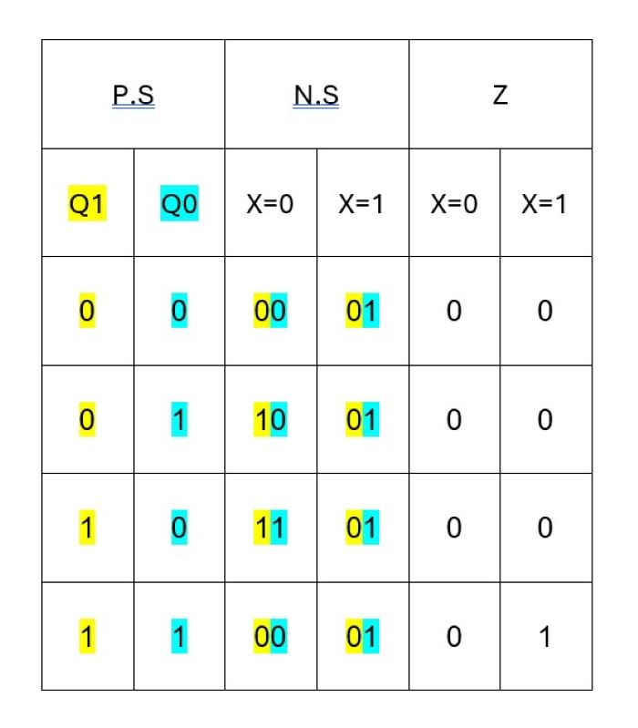
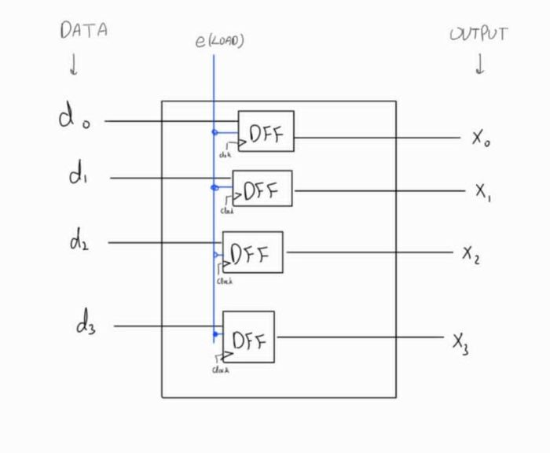

# Protected-Hamming-Encoder📡
### (4,7) Hamming encoder protected by a Mealy FSM. Includes design and testbench.
## Full system overview

## FSM Design⚙
This is a Mealy-type system designed to detect the code 1,0,0,1, allowing repeated sequences.
X is the input signal, and Z is the output, which goes high when the full sequence is detected (starting with q1 = q0 = 0).

### 1. State Diagram

### 2. Excitation Table 

### 3. Karnaugh Maps

### 4. Circuit Implementation

## Register💾
The register loads the data into the Hamming encoder while the load enable signal is high.

## Hamming Encoder🧬
**Hamming Code:** uses parity bits places at positions that are powers of two.
Each parity bit checks specific data bits, enabling detection of tow-bits errors and correction og single-bit errors. 

