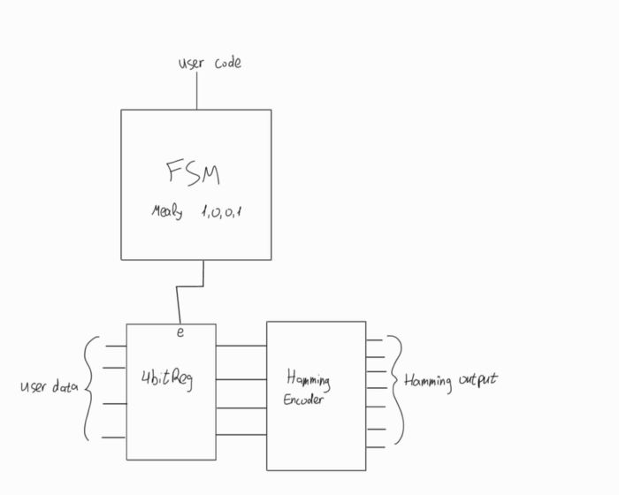
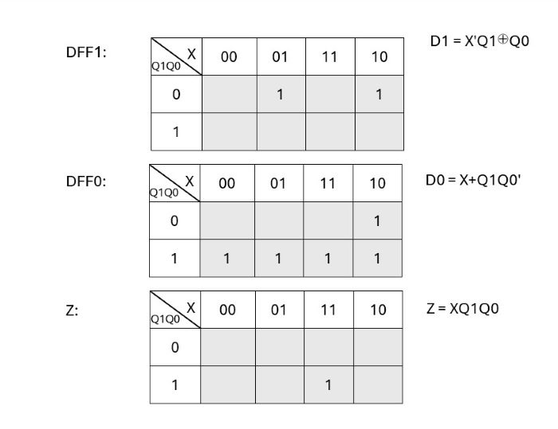

# Protected-Hamming-Encoder📡
### (4,7) Hamming encoder protected by a Mealy FSM. Includes design and testbench.
## Full system overview


## FSM Design⚙
This is a Mealy-type system designed to detect the code 1,0,0,1, allowing repeated sequences.
X is the input signal, and Z is the output, which goes high when the full sequence is detected (starting with q1 = q0 = 0).

### 1. State Diagram


### 2. Excitation Table 


### 3. Karnaugh Maps


### 4. Circuit Implementation


## Register💾
The register loads the data into the Hamming encoder while the load enable signal is high.


## Hamming Encoder🧬
**Hamming Code:** uses parity bits places at positions that are powers of two.
Each parity bit checks specific data bits, enabling detection of tow-bits errors and correction og single-bit errors. 


## How to Run🏃‍♂️

1. Make sure you have Icarus Verilog (IVL) installed.  
2. Open a terminal in the folder containing the files:  
   `fsm.sv`, `hamming.sv`, `register.sv`, `testbench.sv`.  
3. Compile the code with:  
   ```
   iverilog -o simv testbench.sv fsm.sv register.sv hamming.sv
   ```  
4. Run the simulation:  
   ```
   vvp simv
   ```  
5. Output will appear directly in the console. Inputs are predefined in the testbench to simulate user input.
